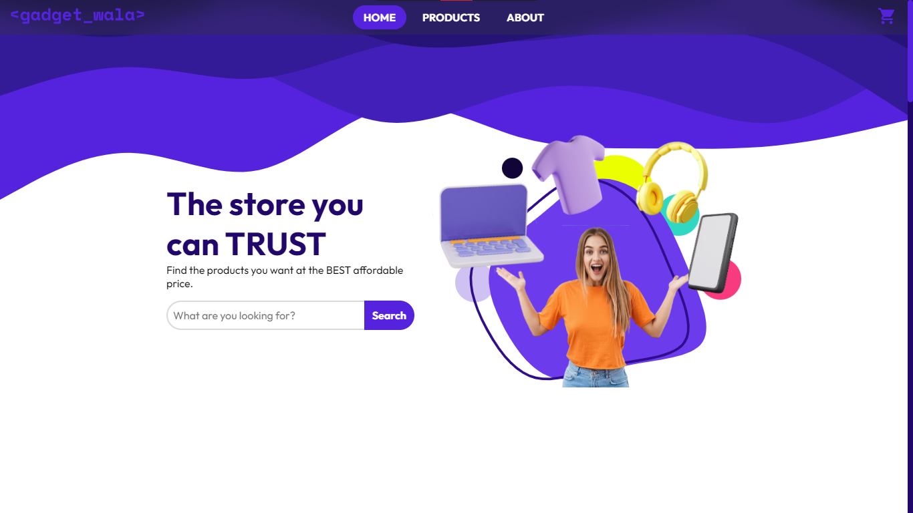

# Gadget Wala - E-Commerce Website

An E-Commerce store website built using front end technologies such as (HTML, CSS, JavaScript, Bootstrap and JQuery).



## Features 
- **Fetch API:** We use the fetch API to asynchronously fetch the products details from the web.
- **Dynamic Content Rendering:** We use JavaScript to dynamically render the API content on the screen such as: Products Cards, Cart Cards.
- **Filters:** We used JavaScript to apply product filtration.
- **Responsive UI:** The UI is optimized and will perform well on smaller screens, as well as larger screens.

## Get a Preview

```txt
link
```

## Built With

- **HTML** - This websites uses the latest version of HTML, that is HTML5. It also incorporates new features such as: Semantic Tags.
- **CSS** - We used the plain version of CSS, with some occasional Bootstrap here and there.
- **JavaScript** - This website relies heavily on JavaScript.
- **[Bootstrap](https://getbootstrap.com/)** - The front-end library framework used.
- **[JQuery](https://jquery.com/)** - We used JQuery for DOM manipulation, dynamically rendering content.


## Authors

- **Muhammad Abdullah Arain** - _Initial work_ - [check out profile](https://github.com/abdullah-dev5)

See also the list of [contributors](https://github.com/abdullah-dev5/E-Commerce/graphs/contributors) who participated in this project.

## License

This project is licensed under the MIT License - see the [LICENSE.md](LICENSE) file for details.
